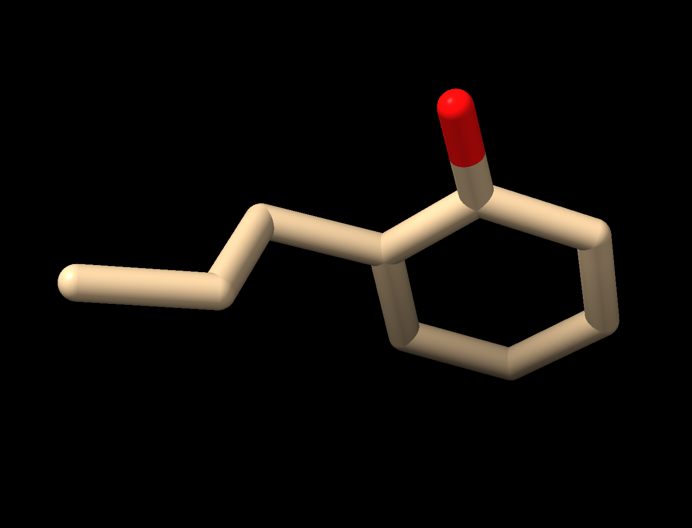
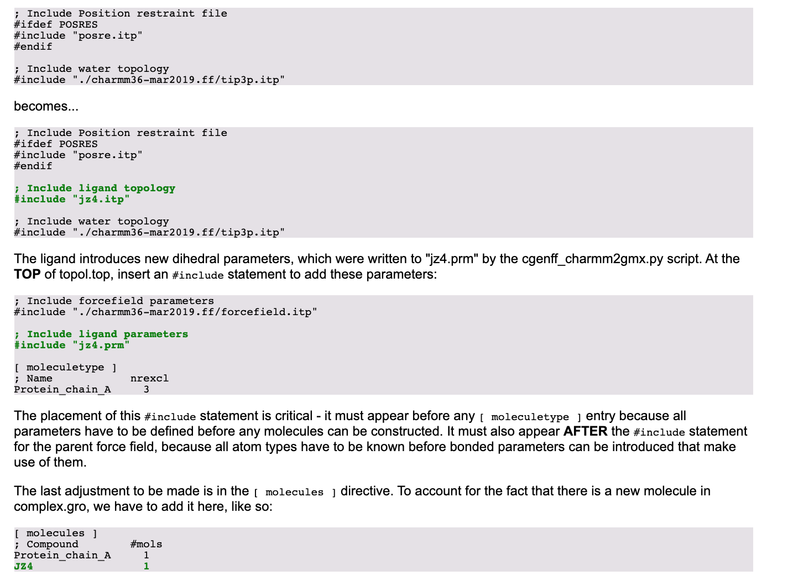
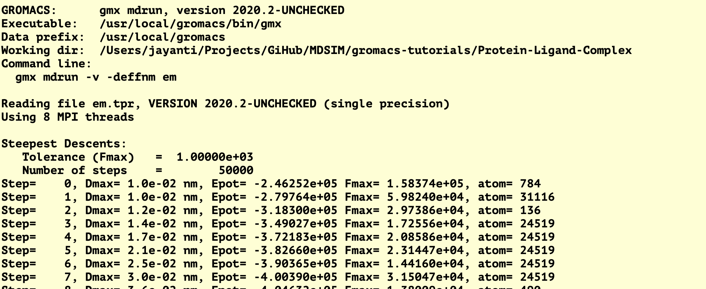
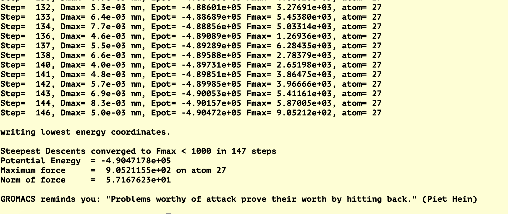

# GROMACS Tutorial : Protein-Ligand Complex

## What it is ?

-  This is a tutorial to simulate a protein-ligand system using molecular dynamics with 
   Gromacs.

-  Reference to the original tutorial is [here](http://www.mdtutorials.com/gmx/complex/index.html)

## Why this tutorial is written ?

- I have noticed that the original tutorial is too lengthy and that makes it hard to read 
  each and every detail and so does not help much.

- The original tutorial also misses many important steps in between and so the chains of
  steps to reach the last step is broken.

## What I am giving here ?

 * A set of scripts 

 * Explanations

## Contact :
   
   Jayanti Prasad Ph.D (prasad.jayanti@gmail.com)

## Reference 

# Tutorial 

## A. Requirements :

  * Python 3.0 

  * [GROMACS version: 2020.2-UNCHECKED](http://manual.gromacs.org/)

  * [UCSF ChimeraX version 1.0 (2020-05-29)](http://www.rbvi.ucsf.edu/chimerax)

  * [AVAGADRO](http://manual.gromacs.org/)

  * [NETWORKX (1.11)](https://networkx.github.io/documentation/stable/)

  * [PBD Tools](https://github.com/haddocking/pdb-tools/)
  

## B. Getting the data :

  -  Step 1: Download the data (.pdb) file from [here](https://www.rcsb.org/structure/3HTB)

  -  Step 2: Now we will extract chain A (lysozyme) and a ligand (JZ4) from the combined pdb 
     file with the following commands. Note that you can confirm the structure and content 
     of the pdb file by loading it into [ChiemaraX)(https://www.rbvi.ucsf.edu/chimerax/)

  -  Extracting the chain A :

     > pdb_selchain -A data/3htb.pdb  | pdb_delhetatm | pdb_tidy > 3HTB_clean.pdb

  - Extracting the ligand JZ4 :

    > `grep JZ4 data/3htb.pdb  > jz4.pdb` 
      
    Please check the path of your downloaded file (I am having it in 'data' folder). In fact 

    <figure>
    
    <figcaption> Raw image </figcaption>
    </figure>

    <figure>
    
    <figcaption> Protein Chain A (Lysozyme) </figcaption>
    </figure>

    <figure>
    
    <figcaption> Ligand JZ4 </figcaption>
    </figure>

## C. Preparing the scripts 

    Now we have two pdb files, one for the protein and another for the ligand. In order to
    carry out molecular dynamics simulations we need at least the following three files:

    - Protein + ligand in a single file (pdb or gmx format)

    - A topology file which has topology of both the protein and ligand. 

    - A parameter files (mdp) specifying the parameters for this simulations.
   
     We may also need few other files (such as for adding ions etc. and will be explained below).

     The hardest part is to create a topology file which is consistent with GROMACS convention 
     and is acceptable. At present it is not possible to create a topology file for an input (pdb)
     file which is having a ligand also. Again, the topology file must be consistent with the 'force field'
     and the 'water model' being used. 

     There are many online tools which can be used to create a topology file but there is no guarantee that
     they will work. You can check 
   [here] (http://manual.gromacs.org/2019/reference-manual/topologies.html) for more. 

## 1. Create the topology file for the protein 

     We already have protein pdb file (3HTB_clean.pdb) so we can apply 'pb2gmx' on it in the following way. 

     > `gmx pdb2gmx -f 3HTB_clean.pdb -o 3HTB_processed.gro`

     Please note the following :

     - Make sure you have 'charmm36-mar2019.ff'  available in your local directory before running this command.

     - You must give input '1' and '1' when asked for giving the force field an 'water model'.

     Once the above command is successful you will have the following output files:

     - 3HTB_processed.gro  : Coordinate file in 'gro' format. 
  
     - topol.top  : Topology file for the protein 

     - posre.itp  : Position information file.  
 

## 2. Create the topology file for the Ligand 

     - Step 1: Convert ligand file to '.mol2' using  Avagadro following thse instructions:

      (i)  Open jz4.pdb in Avagadro  (ii) from the "Build" menu, choose "Add Hydrogens" (iii)
       save a .mol2 file (File -> Save As... and choose Sybyl Mol2 from the drop-down menu) named "jz4.mol2.         
      
       Once the '.mol2' file is created we must clean it and you can use the following command for that.

       > `python clean_mol2.py jz4.mol2 JZ4 > jz4_clean.mol2`

       Note that the script 'clean_mol2.py' is by written by me and may not work for other cases so
       you may need to clean that manually by using some editor.

    - Step 2: Now visit  [CGenFF](https://cgenff.umaryland.edu/initguess/) and after registration upload 
      'jz4_clean.mol2' file there for creating topology.
      The topolgy will be created in a '.str' file so clean on that and copy and paste the content of that
      in a file of the same name - 'jz4_clean.str'

    - Step 3 : Now  create the actual topolgy file by running the following python script:

      > `python cgenff_charmm2gmx_py3_nx1.py JZ4 jz4_clean.mol2 jz4_clean.str charmm36-mar2019.ff/`

      This may give some warning which you can ignore and look for the following two files:
      (i) jz4.itp (ii) jz4.prm and (iii) jz4_ini.pdb

    - Step 4: Get the coordinates of the ligand from the output 'pdb' file in the last step with the follwing command:

     > `gmx editconf -f jz4_ini.pdb -o jz4.gro`

    - Step 4: Now we have to create a 'gro' file which has coordinates of both the protein and ligand.
     and for that we must copy the content from 'jz4.gro' file to a copy of the 'gro' file of the protein.

     So let us make a copy of the protein 'gro' file 

     > `cp 3HTB_processed.gro complex.gro'

     Now insert the content from 'jz4.gro' to 'complex.gro' follwing 
     the instruction [here](http://www.mdtutorials.com/gmx/complex/02_topology.html)            

    - Step 5: This is most complex step and involve 'topol.top' file created for the protein 
     So you need to make the following changes in that:
     for that see the image below.
    
<figure>

<figcaption> Editing topology file </figcaption>
</figure>
   

## 3. Defining the Unit Cell & Adding Solvent

  - If the topology file is correct then you can run the following two commands without any issue.

    > `gmx editconf -f complex.gro -o newbox.gro -bt dodecahedron -d 1.0`

    > `gmx solvate -cp newbox.gro -cs spc216.gro -p topol.top -o solv.gro`

    you can check the Gromacs tutorial page for the reference.

  - Adding ions

    > `gmx grompp -f config/ions.mdp -c solv.gro -p topol.top -o ions.tpr`

    > `gmx genion -s ions.tpr -o solv_ions.gro -p topol.top -pname NA -nname CL -neutral` 

    The second command asks for an input so give '15'

## 4. Molecular dynamics simulations

    Now we have all the ingredients in place so create an input file for the simulation with 

    > `gmx grompp -f config/em.mdp -c solv_ions.gro -p topol.top -o em.tpr`

    Once our input file 'em.trp' is ready we can go ahead and start the simulation run with :

    > `gmx mdrun -v -deffnm em`

    If you are successful you will get something like the following on your terminal.

 
<figure>

<figcaption> Run starts </figcaption>
</figure>
       
<figure>

<figcaption> Run completes </figcaption>
</figure>

## Thanks 

Molecular dynamics simulations are some of the most complex simulations and even just
repeating a tutorial is not easy. 99 % chances are that the topology file which you
create for your problem will not work if do not understand the content.

Once the simulation runs are over post processing is something for which I do not think
anyone needs any tutorial.

I will try to automate the whole process by writing my own python scripts so keep checking.

