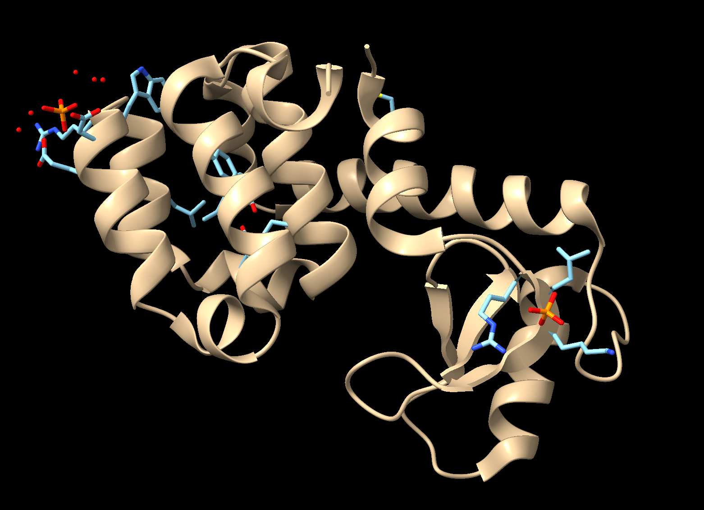
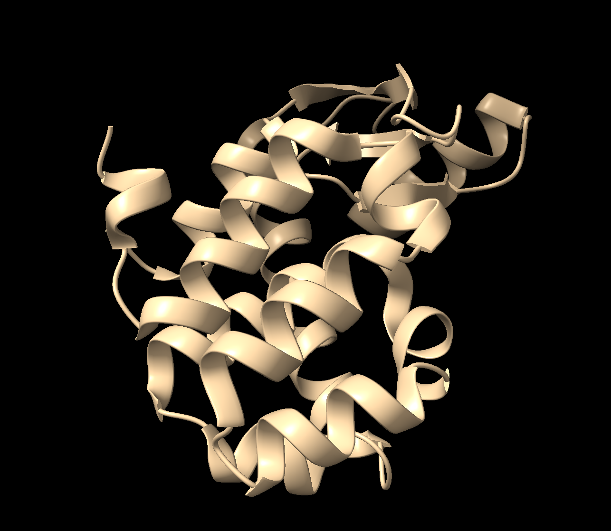

# GROMACS Tutorial : Protein-Ligand Complex

## What it is ?

-  This is a tutorial to simulate a protein-ligand system using molecular dynamics with 
   Gromacs.

-  Reference to the original tutorial is given below.

## Why this tutorial is written ?

- I hane noticed that the original tutorial is too length and that makes hard to read 
  each and every detail and so does not help much.

- The original tutotial also misses many important steps in between and so the chains of
  steps to reach the last step is broken.

## What I am giving here ?

 * A set of scripts 

 * Explanations

 * Reference 

## Conatct :
   
   Jayanti Prasad Ph.D (prasad.jayanti@gmail.com)

## Reference 

# Tutorial 

## Introduction : 

## Getting the data :

  -  Step 1: Download the data (.pdb) file from [here](https://www.rcsb.org/structure/3HTB)

  -  Step 2: Now we will extract chain A (lysozyme) and a legand (JZ4) from the combined pdb 
     file with the following commands. Note that you can confirm the structure and content 
     of the pdb file by loading it into [ChiemaraX)(https://www.rbvi.ucsf.edu/chimerax/)

  -  Extracting the chain A :

    `pdb_selchain -A data/3htb.pdb  | pdb_delhetatm | pdb_tidy > 3HTB_clean.pdb` 

  - Extracting the legand JZ4 :

    `grep JZ4 data/3htb.pdb  > jz4.pdb` 
      
    Please cheak the path of your downloaded file (I am having it in 'data' folder). In fact 
    you do not need it to download and you can just use what I have. 

    <!-- .element height="50%" width="50%" -->

    <!-- .element height="50%" width="50%" -->

    <!-- .element height="50%" width="50%" -->

  
 

  
